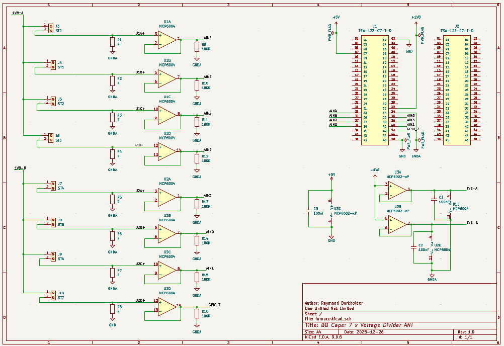
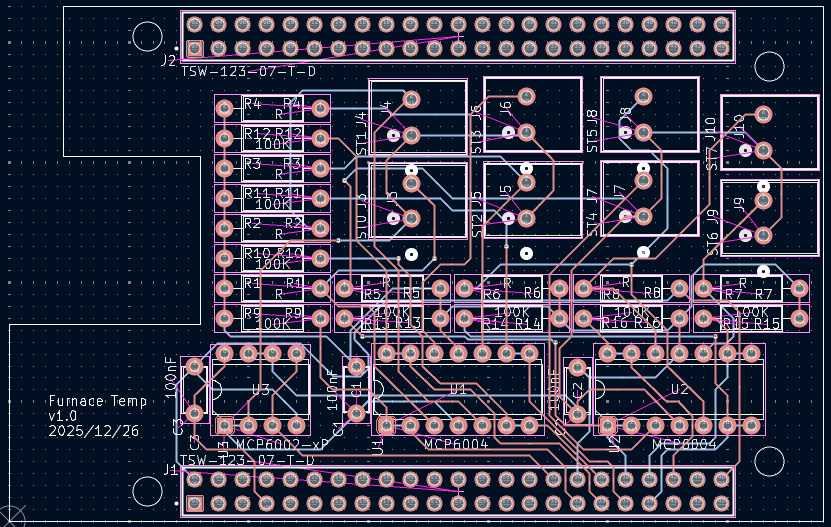
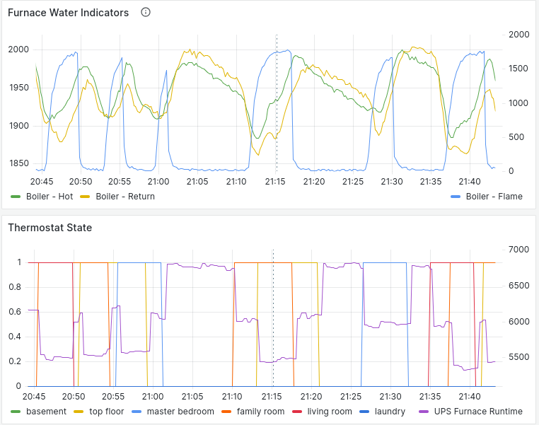

# BeagleBone Black/Green Cape for Voltage Divider based Analog Input for 7 channels.

* Current version supports thermister and LDR (light dependent resister)
* The book "Exploring BeagleBone®: Tools and Techniques for Building with Embedded Linux®, Second Edition" by Derek Molloy is the source of inspiration
* Relevant Pages include:
  * page 178 - 181 Operational Amplifiers - voltage source, voltage follower, buffer
  * page 248 - 249 Interface Ports
  * page 280 - 282 Analog Inputs, how to read
  * page 282 - 284 unbuffered light meter voltage divider
  * page 420 - 426 buffering analog input
  * page 427 - 431 voltage division & scaling with op-amp included

In effect:
* the two op-amp MCP6002 provides a buffered 1.8V rail-to-rail output for use by the voltage dividers
* the eight op-amp MCP6004 provides a rail-to-rail voltage follower to provide high input impedance for the voltage divider, and low output impedance to the BB analog input pins

Results, as of 2025/12/26 - not etched yet:
* 
* 
* 
  * Two thermisters show the furnace water temperature (hot water exit, cold water return) and a light detecting resistor in the furnace to detect flame.  
    * it shows the lag times of a) hot water heating the pipe which the hot water thermister detects, and b) some lag for the water to cool and cycle back to the cold return of the furnace (values are unscaled 0-4095)
  * The aquastat controls when the flame is on based upon a) at least one thermostat is calling for hot water, and b) the water needs to be brought back to temperature
  * The UPS furnace runtime is a delegate way to determine how much work the water pump is performing - the more valves opened, the more water to push, the more energy required (UPS runtime reduces due to higher power demanded).

The whole reason for this configuration is due to this being an older system and the natural gas valve has recently had a tendency to stick open, which causes the water to overheat.  This is my interim way to detect when the furnace does not turn off and I have a minute or two to tap the valve so that it closes.  A replacement is supposed to be on its way.

Contributing projects:
* [ad2mqtt](https://github.com/rburkholder/ad2mqtt) - reads the BeagleBone Analog Inputs and publishes to an MQTT message broker
* [apparition](https://github.com/rburkholder/apparition) - a home monitoring and automation solution focussing on LUA scripting
  * [analog_in.lua](https://github.com/rburkholder/apparition/blob/master/var/script/analog_in.lua) - subscribes to the analog values, checks limits, and issues telegram messages while the water temperature rises above a limit
